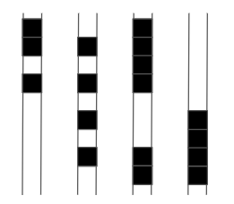

layout: true
  
<div class="my-header"></div>

<div class="my-footer">
  <table>
    <tr>
      <td style="text-align:right">Sächsische Landesbibliothek – Staats- und Universitätsbibliothek</td>
      <td>3. Mai 2024</td>
      <td style="text-align:right"><a href="https://www.slub-dresden.de/">www.slub-dresden.de</a></td>
    </tr>
    <tr>
      <td style="text-align:right">Referat Digitale Objekte</td>
      <td />
    </tr>
  </table>
</div>

<div class="my-title-footer">
  <table>
    <tr>
      <td style="text-align:left"><b>Robert Sachunsky</b></td>
    </tr>
    <tr>
      <td style="text-align:left">Referat Digitale Objekte</td>
    </tr>
    <tr>
      <td style="font-size:8pt"><b>3. Mai 2024</b></td>
    </tr>
    <tr>
      <td style="font-size:8pt">Vorlesung <i>Information Retrieval</i></td>
    </tr>
  </table>
</div>

---

class: title-slide
count: false

# Vom Textobjekt zum maschinenlesbaren Volltext

---

# Überblick

- Belege als Forschungsgrundlage
  + Textdokumente als Belegquelle
- Komponenten eines einfachen OCR-Workflows
- Texterkennung: Zeichenorientierte Ansätze
- Texterkennung: Zeilenorientierte Ansätze
  + Exkurs: Sequenzklassifikation
- Texterkennung: Werkzeuge
- Texterkennung: OCR mit Wikimedia

---

# Belege als Forschungsgrundlage

.cols[
.fourty[
- empirische Forschung → Belege
]
.sixty[
]
]

---

count: false

# Belege als Forschungsgrundlage

.cols[
.fourty[
- empirische Forschung → Belege
]
.sixty[
<p style="margin-top:-20px">
<br />
<a style="font-size:8pt" href="https://commons.wikimedia.org/wiki/File:Gneis2.jpg">Bild: Grabenstedt (CC-Attribution SA 3.0 Unported)</a>
</p>
]
]

---

count: false

# Belege als Forschungsgrundlage

.cols[
.fourty[
- empirische Forschung → Belege
]
.sixty[
<p style="margin-top:-20px">

</p>
]
]

---

count: false

# Belege als Forschungsgrundlage

.cols[
.fourty[
- empirische Forschung → Belege
]
.sixty[
<p style="margin-top:-20px">

</p>
]
]

---

count: false

# Belege als Forschungsgrundlage

.cols[
.fourty[
- empirische Forschung → Belege
]
.sixty[
<p style="margin-top:-20px">

</p>
]
]

---

count: false

# Belege als Forschungsgrundlage

.cols[
.fourty[
- empirische Forschung → Belege
- Textdokumente als prominente Belegquelle
    + Linguistik
    + Geschichte
    + Recht
    + Philosophie
    + ...
]
.sixty[
<p style="margin-top:-20px">

</p>
]
]

---

count: false

# Belege als Forschungsgrundlage

.cols[
.fourty[
- empirische Forschung → Belege
- Textdokumente als prominente Belegquelle
    + Linguistik
    + Geschichte
    + Recht
    + Philosophie
    + ...
- zentrale Grundlage der **digitalen Geisteswissenschaften**
]
.sixty[
<p style="margin-top:-20px">

</p>
]
]

---

# Textdokumente als Belegquelle

- Vorteile
    + in großem Umfang verfügbar
    + systematisch gesammelt
    + einfach reproduzierbar
    + leicht zu lesen
    + **relativ einfach digitalisierbar**
- *Korpora*: repräsentative Erfassung einer Sprache, eines Sprachstandes, eines speziellen Ausschnitts einer Sprache
    + Referenzkorpora
        * British National Corpus [(Leech 1992)](https://hdl.handle.net/10371/85926)
        * Deutsches Textarchiv [(Geyken et al. 2011)](http://www.hbz-nrw.de/dokumentencenter/veroeffentlichungen/Tagung_Digitale_Wissenschaft.pdf#page=159)
    + Spezialkorpora
        * *childLex* [(Schroeder et al. 2014)](https://link.springer.com/article/10.3758/s13428-014-0528-1)
        * Internetblogs [(Barbaresi und Würzner 2015)](https://edoc.bbaw.de/opus4-bbaw/frontdoor/index/index/docId/2330)
        * *Berliner Wendekorpus* [(Dittmar und Paul 2019)](https://ids-pub.bsz-bw.de/frontdoor/deliver/index/docId/9349/file/Dittmar_Paul_Sprechen_im_Umbruch_2019.pdf)

---

# Textdokumente als Belegquelle

- **Problem**: viele Dokumente nicht grundständig digital verfügbar
- **Problem**: Digitalisierung ⇏ Texterfassung

<center>

</center>

---

count: false

# Textdokumente als Belegquelle

- **Problem**: viele Dokumente nicht grundständig digital verfügbar
- **Problem**: Digitalisierung ⇏ Texterfassung

<center>

</center>

---

count: false

# Textdokumente als Belegquelle

- **Problem**: viele Dokumente nicht grundständig digital verfügbar
- **Problem**: Digitalisierung ⇏ Texterfassung

<center>
<br />
<a style="font-size:8pt" href="https://commons.wikimedia.org/wiki/File:170423-Einkaufszettel-01.jpg">Bild: BlueBreezeWiki (CC-BY-SA 3.0)</a>
</center>

---

count: false

# Textdokumente als Belegquelle

- **Problem**: viele Dokumente nicht grundständig digital verfügbar
- **Problem**: Digitalisierung ⇏ Texterfassung

<center>
<br />
<a style="font-size:8pt" href="https://de.wikipedia.org/wiki/Datei:Teibert_Whitecaps_Interview.jpg">Bild: betancourt (CC-BY 2.0)</a>
</center>

---

# Fokus: Texterfassung per OCR

.cols[
.sixty[
- Bilderfassung ≠ Texterfassung
- **O**ptical **C**haracter **R**ecognition: Automatische Erfassung von Text in Bildern
- ursprünglich begrenzt auf Zeichenerkennung
- heute häufig Synonym für den gesamten Texterfassungsprozess
  + Bildvorverarbeitung
  + Layoutanalyse (OLR)
  + Zeilenerkennung
  + ...
]
.fourty[
<center></center>
]
]

---

# Komponenten eines einfachen OCR-Workflows

.cols[
.fifty[
]
.fourty[
<p style="margin-top:-80px">

</p>
]
]

---

count: false

# Komponenten eines einfachen OCR-Workflows

.cols[
.fifty[
- Bildvorverarbeitung
]
.fourty[
<p style="margin-top:-80px">

</p>
]
]

---

count: false

# Komponenten eines einfachen OCR-Workflows

.cols[
.fifty[
- Bildvorverarbeitung
]
.fourty[
<p style="margin-top:-80px">

</p>
]
]

---

count: false

# Komponenten eines einfachen OCR-Workflows

.cols[
.fifty[
- Bildvorverarbeitung
- Layoutanalyse
]
.fourty[
<p style="margin-top:-80px">

</p>
]
]

---

count: false

# Komponenten eines einfachen OCR-Workflows

.cols[
.fifty[
- Bildvorverarbeitung
- Layoutanalyse
]
.fourty[
<p style="margin-top:-80px">

</p>
]
]

---

count: false

# Komponenten eines einfachen OCR-Workflows

.cols[
.fifty[
- Bildvorverarbeitung
- Layoutanalyse
    * **strukturierende** Elemente
        + Absätze
        + Überschriften
]
.fourty[
<p style="margin-top:-80px">

</p>
]
]

---

count: false

# Komponenten eines einfachen OCR-Workflows

.cols[
.fifty[
- Bildvorverarbeitung
- Layoutanalyse
    * **strukturierende** Elemente
        + Absätze
        + Überschriften
    * **textflussunterbrechende** Elemente
        + Seitenzahlen
        + Kolumnentitel
        + Abbildungsunterschriften
        + Marginalien etc.
]
.fourty[
<p style="margin-top:-80px">

</p>
]
]

---

count: false

# Komponenten eines einfachen OCR-Workflows

.cols[
.fifty[
- Bildvorverarbeitung
- Layoutanalyse
    * **strukturierende** Elemente
        + Absätze
        + Überschriften
    * **textflussunterbrechende** Elemente
        + Seitenzahlen
        + Kolumnentitel
        + Abbildungsunterschriften
        + Marginalien etc.
    * **nichttextuelle** Elemente
        + Abbildungen
        + Tabellen etc.
]
.fourty[
<p style="margin-top:-80px">

</p>
]
]

---

count: false

# Komponenten eines einfachen OCR-Workflows

.cols[
.fifty[
- Bildvorverarbeitung
- Layoutanalyse
    * **strukturierende** Elemente
        + Absätze
        + Überschriften
    * **textflussunterbrechende** Elemente
        + Seitenzahlen
        + Kolumnentitel
        + Abbildungsunterschriften
        + Marginalien etc.
    * **nichttextuelle** Elemente
        + Abbildungen
        + Tabellen etc.
- Texterkennung
]
.fourty[
<p style="margin-top:-80px">

</p>
]
]

---

# Texterkennung: <u>Zeichen</u>orientierte Ansätze

.cols[
.seventy[
- Erkennung erfolgt *glyphenweise*
  - **Mustervergleich**: Vergleich der Zeichenbilder zu in einem „Setzkasten“ gespeicherten Glyphen **Pixel für Pixel**
  - **Merkmalsvergleich**: Zerlegung der Glyphen in vordefinierte, bedeutungstragende **Eigenschaften** wie *Einfärbung*, *Kurven*, *Linien* etc. und Vergleich zu Referenzmaterialien
]
.fourty[
<center></center>
]
]

---

count: false

# Texterkennung: <u>Zeichen</u>orientierte Ansätze

.cols[
.seventy[
- Erkennung erfolgt *glyphenweise*
  - **Mustervergleich**: Vergleich der Zeichenbilder zu in einem „Setzkasten“ gespeicherten Glyphen **Pixel für Pixel**
  - **Merkmalsvergleich**: Zerlegung der Glyphen in vordefinierte, bedeutungstragende **Eigenschaften** wie *Einfärbung*, *Kurven*, *Linien* etc. und Vergleich zu Referenzmaterialien
]
.fourty[
<center></center>
]
]
- Zerlegung der Seite in *Zeilen* und *Zeichen* notwendig

---

# Texterkennung: <u>Zeilen</u>orientierte Ansätze

- Erkennung erfolgt *zeilenweise*
  1. **Skalierung:** einheitliche Höhe für alle Zeilen
  2. **Merkmalsextraktion**: Raster mit festgelegter Anzahl (horizontaler) Zeilen und variabler Anzahl (vertikaler) Spalten → Zeilen als Sequenzen binärwertiger Vektoren fixer Länge
<center></center>
- kontextsensitive Erkennung über *Übergangswahrscheinlichkeiten* der Vektoren
- Zerlegung der Seite in *Zeilen* notwendig
- Vorgehen robuster gegenüber Varianz durch Artefakte als zeichenorientierte Ansätze
- `Tesseract` (ab Version 4), `OCRopus`, `kraken`, `Calamari`
  + Einsatz *neuronaler Netze* für die Sequenzklassifikation

---

# Texterkennung: <u>Zeilen</u>orientierte Ansätze

- Sequenzierung per Vektorisierung
    + **Skalierung** auf einheitliche Höhe
    + **Unterteilung** in 1pixel-breite Streifen

<center>

</center>
<center>
<p>↓</p>
</center>
<center>

</center>

---

# Texterkennung: <u>Zeilen</u>orientierte Ansätze

- Tabelle mit fester Anzahl Zeilen und variabler Anzahl Spalten
- schwarze (1) und weiße (0) Pixel
    + **endliche Anzahl** mgl. Belegungen
- charakteristische Abfolge pro Zeichen (und Wort)

<center>

</center>
<center>
<p>↓</p>
</center>
<center>

</center>

---

# Exkurs: Sequenzklassifikation

- zentrales Verfahren des maschinellen Lernens (cf. e.g. [Xing et al. 2010](https://www.cs.sfu.ca/~jpei/publications/Sequence%20Classification.pdf))
- basierend auf dem **Satz von Bayes**: `\(P(C|E) = \frac{P(E|C)\cdot P(C)}{P(E)}\)`
- Rezept
    + Man nehme
        * eine **sehr große** Liste **manuell annotierter** Daten und
        * einen **Trainingsalgorithmus**,
    + modelliere eine **`n:n`-Beziehung** zwischen Eingabe und Ausgabe,
        * e.g., jedes Eingabeelement (Buchstabe) wird auf eine Klasse abgebildet
    + induziere ein **statistisches Modell**,
    + und evaluiere dessen Qualität anhand von **Evaluationsdaten**

---

# Exkurs: Sequenzklassifikation

- Illustration am Beispiel Worttrennung
    + Daten
        * http://de.wiktionary.org
        * Worttrennungsangaben für > 250 000 deutsche Wörter
        * `Elektrik ↦ Elek·t·rik`

---

count: false

# Exkurs: Sequenzklassifikation

- Illustration am Beispiel Worttrennung
    + Daten
        * http://de.wiktionary.org
        * Worttrennungsangaben für > 250 000 deutsche Wörter
        * `Elektrik ↦ Elek·t·rik`
    + Kodierung `\(f: \Sigma\rightarrow\mathbb{B}\)` 
      $$
      f(x) = \begin{cases} 1 & x\,\text{gefolgt von Trennstelle} \\\\
      0 & \, \text{sonst}\end{cases}
      $$ 
      ```
      E l e k t r i k
      0 0 0 1 1 0 0 0
      ```

---

count: false

# Exkurs: Sequenzklassifikation

- Illustration am Beispiel Worttrennung
    + Daten
        * http://de.wiktionary.org
        * Worttrennungsangaben für > 250 000 deutsche Wörter
        * `Elektrik ↦ Elek·t·rik`
    + Kodierung `\(f: \Sigma\rightarrow\mathbb{B}\)` 
      $$
      f(x) = \begin{cases} 1 & x\,\text{gefolgt von Trennstelle} \\\\
      0 & \, \text{sonst}\end{cases}
      $$ 
      ```
      E l e k t r i k
      0 0 0 1 1 0 0 0
      ```
    + Training
        * Zählen von Sequenzen aus Eingabe-Ausgabe-Paaren
        * Berechnung bzw. Schätzung einer Wahrscheinlichkeitsverteilung
        * Repräsentation als statistisches Modell (**H**idden **M**arkov **M**odel, **C**onditional **R**andom **F**ield, **N**euronales **N**etz)

---

# Exkurs: Sequenzklassifikation

- einfacher aber wirkungsvoller Algorithmus für Anwendungen in
    + Sprachverarbeitung, e.g.
        * Tokenisierung (Zeichen → Wortgrenzen)
        * Wortartenerkennung (Wörter → Wortarten)
        * Textklassifikation (Texte → Textsorten, `n:1`-Problem)
    + Bioinformatik, e.g.
        * Proteinklassfizierung in DNA-Sequenzen (Nukleinbasen → Aminosäuren)
    + Bildverarbeitung, e.g.
        * Layouterkennung (Pixel → Layoutelemente)
        * **Texterkennung** (Pixelvektoren → Buchstaben)
- unzählige gute (Python-)Tutorials vefügbar, e.g.
    + [Wortartenerkennung mit CRFs](https://albertauyeung.github.io/2017/06/17/python-sequence-labelling-with-crf.html/)
    + [DNA-Sequenzierung mit HMMs](https://github.com/jmschrei/pomegranate/blob/master/tutorials/B_Model_Tutorial_3_Hidden_Markov_Models.ipynb)
    + [Stimmungsbewertung in Filmkritiken mit NNs](https://machinelearningmastery.com/sequence-classification-lstm-recurrent-neural-networks-python-keras/)

---

# Texterkennung: Zeilenorientierte Ansätze

- Übertragung auf OCR
    + Daten
        * https://htr-united.github.io/
        * manuell transkribierte Textzeilen
    + Kodierung `\(f: \mathbb{N}^{10}\rightarrow\mathbb{B}\)` 
      $$
      f(x[n]) = \begin{cases} 1 & \text{Pixel in Zelle $(x,n)$ schwarz} \\\\
      0 & \, \text{sonst}\end{cases}
      $$ 
    + Training
        * Zählen von Sequenzen aus Vektor-Buchstabenteil-Paaren
        * Repräsentation als OCR-Modell
        * Tesseract: [tesstrain](https://github.com/tesseract-ocr/tesstrain)
.cols[
.fifty[
```
  0123456789
0 1111111111
2 0000110000 
```
]
.fifty[
<center>

</center>
]
]

---

# Texterkennung: Werkzeuge

- Software (Engines)
    + [**Tesseract**](https://github.com/tesseract-ocr/tesseract): komplettes Open-Source-Paket
        * regelbasierte Bildvorverarbeitung und Layouterkennung
        * datengetriebene Texterkennung (unterstützt > 100 Sprachen)
        * Ease-of-Use-Training eigener Modelle
        * für OCR (und HTR) verwendbar
    + [**OCRopy**](https://github.com/ocropus/ocropy): umfangreiches Open-Source-Paket
        * regelbasierte Bildvorverarbeitung und Layouterkennung
        * datengetriebene Texterkennung (nur sehr wenige Modelle vorhanden)
        * für OCR (und HTR) verwendbar
        * prominente Ableger: [**Kraken**](https://kraken.re) und [**Calamari**](https://github.com/Calamari-OCR/calamari)
    + [HTR+](https://readcoop.eu/wp-content/uploads/2018/12/D7.9_HTR_NN_final.pdf), [PyLaia](https://github.com/jpuigcerver/PyLaia/)...
    + [TrOCR](https://github.com/microsoft/unilm)...
<!--    + Google, Amazon, Microsoft... -->

---

# Texterkennung: Werkzeuge

- Software (Platforms)
    + [**OCR-D**](https://ocr-d.de/): Workflow-Engine
        * Orchestrierung verschiedener Open-Source-Pakete zu stabilen Workflows
        * gleichzeitig DFG-Förderprogramm zur Verbesserung von OCR für historische Drucke
        * SLUB als maßgebliche Entwicklungseinrichtung
    + [Transkribus](https://www.transkribus.org/)
    + [OCR4all](https://github.com/OCR4all/)
    + [eScriptorium](https://gitlab.com/scripta/escriptorium)
    + [Wikimedia OCR](https://ocr-test.wmcloud.org/)

---

# Texterkennung: OCR mit Wikimedia

- einfaches Webinterface zur OCR von Wikimedia-Inhalten

<center>

</center>

→ [ocr-test.wmcloud.org](https://ocr-test.wmcloud.org/)

---

# Texterkennung: OCR mit Wikimedia

Aufgabe
- Suchen Sie sich ein [geeignetes Bild](https://upload.wikimedia.org/wikipedia/commons/0/0e/Weisse_Scherzhafte_Lieder_003.jpg) bei Wikimedia.Commons (Tipp: via Wikisource)!
- Führen Sie eine OCR aus!
- Kopieren Sie sich das Textresultat!
- Führen Sie eine zweite OCR mit veränderten Parametern aus!
- Kopieren Sie sich das Textresultat
- Vergleichen Sie die Ergebnisse auf [diffchecker](https://www.diffchecker.com/)! Was fällt Ihnen alles auf?

---

# Texterkennung: OCR mit Wikimedia

<center>

</center>

---

class: part-slide

# Vielen Dank für Ihre Aufmerksamkeit!

<center>
<a href="https://bertsky.github.io/ringvorlesung-dh-2024-ocr/">bertsky.github.io/ringvorlesung-dh-2024-ocr</a>
</center>
